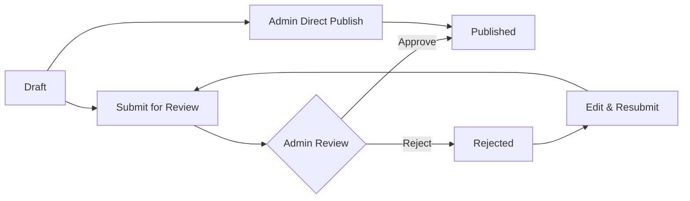

# NewsHub - News Website with Role-Based Access Control

A modern, production-ready news website built with React, TypeScript, and Vite featuring comprehensive role-based access control (RBAC) and content management capabilities.


## 🌟 Features

### 🔐 Authentication & Authorization

- **Role-Based Access Control** with 3 user types: Admin, Employee (Writer), Reader
- **Protected Routes** with automatic redirection
- **Demo Accounts** for easy testing
- **Persistent Sessions** with localStorage
- **Secure Route Protection** based on user permissions

### 📰 Content Management

- **Article Creation** with rich text editor
- **Article Workflow**: Draft → Pending → Approved/Rejected
- **Category-based Organization** with 10+ categories
- **Tag System** for content discovery
- **Search & Filter** functionality
- **Comment System** with moderation capabilities

### 👥 User Roles & Permissions

#### 🔴 Admin

- ✅ Full platform management access
- ✅ Publish articles immediately
- ✅ Approve/reject article submissions
- ✅ Manage user roles and permissions
- ✅ Access comprehensive admin dashboard
- ✅ Moderate comments and content

#### 🔵 Employee (Writer)

- ✅ Create and submit articles for review
- ✅ Track submission status
- ✅ Edit drafts and rejected articles
- ✅ View article performance metrics
- ✅ Comment on articles

#### 🟢 Reader

- ✅ Browse and read published articles
- ✅ Comment on articles
- ✅ Search and filter content
- ✅ Bookmark and like articles

### 🎨 User Experience

- **Responsive Design** - Mobile-first approach
- **Modern UI** - Clean interface with Radix UI components
- **Dark/Light Mode** support
- **Loading States** - Smooth user experience
- **Error Handling** - Graceful error management
- **Accessibility** - ARIA compliant components

### 🚀 Performance Optimizations

- **Memoized Components** - Reduced unnecessary re-renders
- **Stable Authentication State** - Optimized auth checking
- **Lazy Loading** - Improved initial load time
- **Efficient State Management** - Context API with optimization
- **Code Splitting** - Reduced bundle size

## 🛠️ Technology Stack

### Frontend

- **React 18** - Modern React with hooks
- **TypeScript** - Type-safe development
- **Vite** - Fast build tool and dev server
- **React Router 6** - Client-side routing
- **TailwindCSS** - Utility-first CSS framework

### UI Components

- **Radix UI** - Accessible component primitives
- **Lucide React** - Beautiful icon library
- **Framer Motion** - Smooth animations
- **Date-fns** - Date manipulation utilities

### State Management

- **React Context API** - Global state management
- **React Query** - Server state management
- **Custom Hooks** - Reusable stateful logic

### Development Tools

- **ESLint** - Code linting
- **Prettier** - Code formatting
- **TypeScript** - Static type checking
- **Vitest** - Unit testing framework

## 🚀 Getting Started

### Prerequisites

- Node.js 18+
- npm, yarn, or pnpm

### Installation

1. **Clone the repository**

   ```bash
   git clone <repository-url>
   cd newshub
   ```

2. **Install dependencies**

   ```bash
   npm install
   ```

3. **Start development server**

   ```bash
   npm run dev
   ```

4. **Open your browser**
   ```
   http://localhost:8080
   ```

### Build for Production

```bash
npm run build
```

### Run Tests

```bash
npm test
```

## 🔑 Demo Accounts

The application includes pre-configured demo accounts for testing:

| Role       | Email             | Password | Description                              |
| ---------- | ----------------- | -------- | ---------------------------------------- |
| **Admin**  | admin@news.com    | `any`    | Full platform access, content moderation |
| **Writer** | employee@news.com | `any`    | Article creation and submission          |
| **Reader** | reader@news.com   | `any`    | Content consumption and interaction      |

> **Note**: Any password works for demo accounts. In production, implement proper password validation.

## 📁 Project Structure

```
src/
├── components/          # Reusable UI components
│   ├── ui/             # Base UI components (Radix UI)
│   ├── Header.tsx      # Navigation header
│   ├── ArticleCard.tsx # Article display component
│   ├── CommentSection.tsx # Comment functionality
│   └── ProtectedRoute.tsx # Route protection
├── contexts/           # React Context providers
│   ├── AuthContext.tsx # Authentication state
│   └── NewsContext.tsx # News data management
├── pages/              # Route components
│   ├── Index.tsx       # Homepage with article feed
│   ├── Login.tsx       # Authentication
│   ├── AdminDashboard.tsx # Admin panel
│   ├── CreateArticle.tsx # Article creation
│   ├── ArticlePage.tsx # Article detail view
│   └── Profile.tsx     # User profile
├── services/           # Business logic
│   ├── authService.ts  # Authentication logic
│   ├── newsService.ts  # Article management
│   └── mockData.ts     # Demo data
├── types/              # TypeScript definitions
└── hooks/              # Custom React hooks
```

## 🔄 Article Workflow



## 🎯 Key Features in Detail

### Authentication System

- **Mock Authentication** for development
- **Role-based permissions** with fine-grained access control
- **Session persistence** across browser sessions
- **Automatic route protection** based on user roles

### Content Management

- **WYSIWYG Editor** for article creation
- **Image-free Design** with gradient backgrounds
- **Category-based organization** for content discovery
- **Tag system** for content tagging
- **Comment moderation** with user permissions

### Admin Dashboard

- **Content statistics** and analytics
- **User management** interface
- **Article approval** workflow
- **System monitoring** capabilities

### Performance Features

- **Optimized re-renders** with React.memo and useCallback
- **Stable authentication state** preventing constant checks
- **Efficient data fetching** with proper caching
- **Minimal bundle size** with code splitting

## 🔧 Configuration

### Environment Variables

Create a `.env` file in the root directory:

```env
VITE_APP_NAME=NewsHub
VITE_API_URL=http://localhost:3000/api
VITE_ENABLE_MOCK_DATA=true
```

### Customization

- **Styling**: Modify `tailwind.config.ts` for design system changes
- **Routes**: Update `src/App.tsx` for routing configuration
- **Mock Data**: Edit `src/services/mockData.ts` for sample content
- **Categories**: Customize article categories in `mockData.ts`

## 🐛 Troubleshooting

### Common Issues

**Navigation links not working**

- Ensure React Router is properly configured
- Check for missing route definitions
- Verify authentication state is stable

**Authentication constantly checking**

- Verify auth context optimization
- Check for circular dependencies
- Ensure stable function references

**Articles not loading**

- Check mock data service
- Verify user permissions
- Ensure proper error handling

## 🚧 Future Enhancements

### Planned Features

- [ ] **Real Backend Integration** - Replace mock services
- [ ] **Rich Text Editor** - WYSIWYG article editor
- [ ] **File Upload** - Image and media management
- [ ] **Email Notifications** - Article approval alerts
- [ ] **Advanced Search** - Full-text search capabilities
- [ ] **Social Features** - Sharing and social login
- [ ] **Analytics Dashboard** - Detailed content analytics
- [ ] **Content Scheduling** - Publish articles at specific times
- [ ] **Multi-language Support** - Internationalization
- [ ] **PWA Support** - Progressive Web App features

### Technical Improvements

- [ ] **API Integration** - Connect to real backend
- [ ] **Database Schema** - Design production database
- [ ] **Error Boundaries** - Enhanced error handling
- [ ] **Performance Monitoring** - Real-time performance tracking
- [ ] **Security Hardening** - Production security measures
- [ ] **Automated Testing** - Comprehensive test suite
- [ ] **CI/CD Pipeline** - Automated deployment
- [ ] **Docker Support** - Containerized deployment

## 📝 License

This project is licensed under the MIT License - see the [LICENSE](LICENSE) file for details.

## 🤝 Contributing

1. Fork the repository
2. Create a feature branch (`git checkout -b feature/amazing-feature`)
3. Commit your changes (`git commit -m 'Add amazing feature'`)
4. Push to the branch (`git push origin feature/amazing-feature`)
5. Open a Pull Request

## 👨‍💻 Development Team

- **Frontend Architecture** - Modern React with TypeScript
- **UI/UX Design** - Responsive design with TailwindCSS
- **State Management** - Optimized Context API implementation
- **Authentication** - Role-based access control system
- **Performance** - Optimized for production deployment

## 📞 Support

For support and questions:

- Create an issue in the repository
- Check the troubleshooting section
- Review the project documentation

---

**Built with ❤️ using React, TypeScript, and modern web technologies.**
